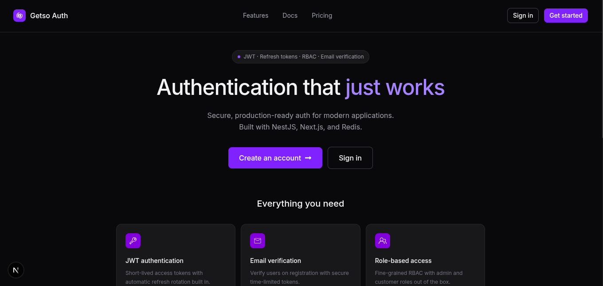
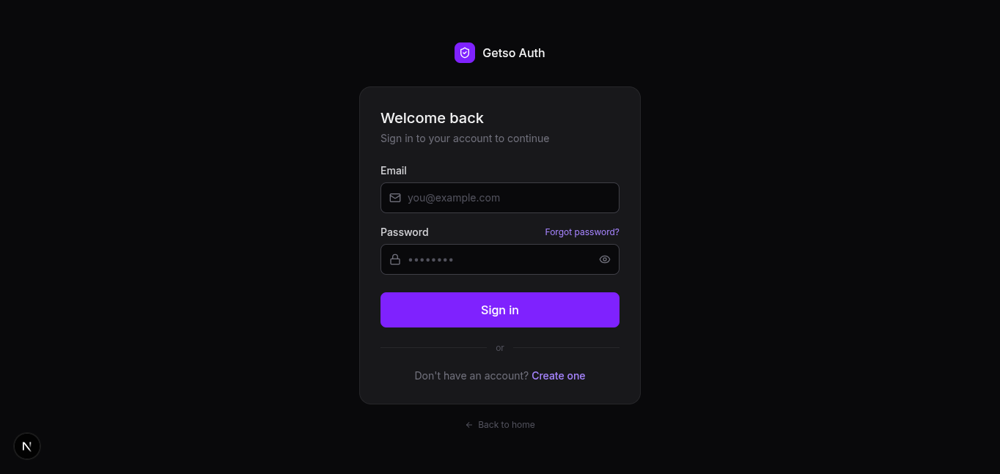
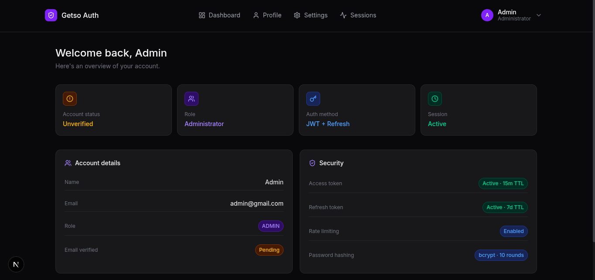
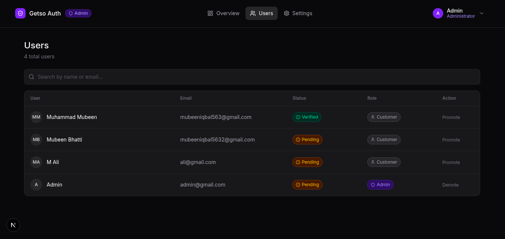

# 🔐 Full-Stack Getso Authentication System

A production-ready authentication system built with modern web technologies, featuring secure JWT authentication, role-based access control, session management, email verification, password recovery, and an admin dashboard.

---

## 🚀 Live Demo

**Frontend:** Coming Soon

**Backend API:** Coming Soon

**Swagger Documentation:** Coming Soon

---

## 📸 Screenshots

### Landing Page



### Login



### Customer Dashboard



### Admin Dashboard


### Users Management



---

# ✨ Features

## Authentication

- JWT Authentication
- Access & Refresh Tokens
- Refresh Token Rotation
- Refresh Token Hashing
- Auto Token Refresh
- Secure Logout

## User Management

- User Registration
- Login
- Email Verification
- Forgot Password
- Password Reset
- Update Profile
- Delete Account

## Authorization

- Role-Based Access Control (RBAC)
- Customer Routes
- Admin Routes
- Global Guards
- Protected Routes

## Session Management

- Device Tracking
- Active Sessions
- Revoke Single Session
- Logout From All Devices
- Redis-backed Sessions

## Security

- Password Hashing (bcrypt)
- Helmet Security Headers
- CORS Configuration
- Rate Limiting
- Redis Login Attempt Protection
- Global Exception Filter
- Response Transform Interceptor

## Admin Panel

- Dashboard Overview
- User Management
- Promote User
- Demote User
- Pagination

## Frontend

- Responsive UI
- React Hook Form
- Zod Validation
- Zustand State Management
- Middleware Route Protection
- Automatic Token Refresh

---

# 🛠 Tech Stack

## Frontend

- Next.js
- TypeScript
- Tailwind CSS
- Zustand
- React Hook Form
- Zod
- Axios

## Backend

- NestJS
- TypeScript
- Prisma ORM
- PostgreSQL
- Redis
- Passport.js
- JWT
- Swagger

---

# 📁 Project Structure

```text
getso-auth-system
│
├── backend
│   ├── src
│   ├── prisma
│   └── ...
│
├── frontend
│   ├── src
│   └── ...
│
└── README.md
```

---

# ⚙️ Installation

## Clone Repository

```bash
git clone https://github.com/yourusername/getso-auth.git

cd saas-authentication-system
```

---

## Backend

```bash
cd backend

pnpm install

pnpm prisma generate

pnpm prisma migrate dev

pnpm start:dev
```

---

## Frontend

```bash
cd frontend

pnpm install

pnpm dev
```

---

# Environment Variables

## Backend

```env
DATABASE_URL=

JWT_ACCESS_SECRET=
JWT_REFRESH_SECRET=

JWT_ACCESS_EXPIRES_IN=15m
JWT_REFRESH_EXPIRES_IN=7d

REDIS_URL=

RESEND_API_KEY=
RESEND_FROM_EMAIL=

FRONTEND_URL=http://localhost:3000
```

## Frontend

```env
NEXT_PUBLIC_API_URL=http://localhost:3001/api
```

---

# API Documentation

Swagger is available at

```
/api/docs
```

---

# Authentication Flow

```
Register
      │
      ▼
Email Verification
      │
      ▼
Login
      │
      ▼
Access Token (15 min)
Refresh Token (7 days)
      │
      ▼
401 Response
      │
      ▼
Automatic Refresh
      │
      ▼
Retry Original Request
```

---

# Security Features

- JWT Authentication
- Refresh Token Rotation
- Refresh Token Hashing
- Email Verification
- Password Reset
- Helmet
- CORS
- RBAC
- Rate Limiting
- Redis Session Storage
- Secure Password Hashing
- Global Exception Filter

---

# Future Improvements

- OAuth (Google / GitHub)
- Two-Factor Authentication (2FA)
- Audit Logs
- User Activity Tracking
- Docker
- Kubernetes
- CI/CD Pipeline
- Unit & Integration Tests

---

# Author

**Muhammad Mubeen**

Software Engineering Student

GitHub:
[https://github.com/MubeenBhatti563](https://github.com/MubeenBhatti563)

LinkedIn:
[https://linkedin.com/in/yourprofile](https://www.linkedin.com/in/muhammad-mubeen-64633231a)

---

# License

MIT License
